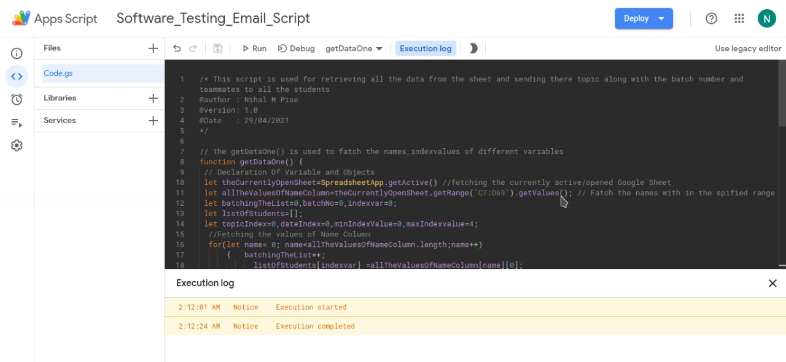
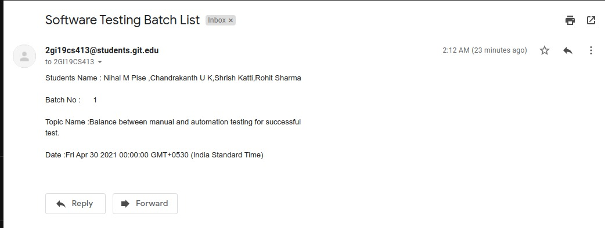

# Google-Sheet-Automation
Google Sheet Email  Mail Automation  Using App-Script 

## Description
A simple script that fetches details such as student name, batch number, topic and date form the google sheet, and generate email address by using USN
and mails batch details to all the students.

## Technology Used:
* Google AppScript

## Demo Google-Sheet Link
* [SoftWare-Testing-Sheet](https://docs.google.com/spreadsheets/d/1mZNFML9dkoob39sP5hZx1_Yvq6pVX4QKLSMLmVVqWmk/edit?usp=sharing)

## Output:
* Successful execution of code:

* Email sent by the code

